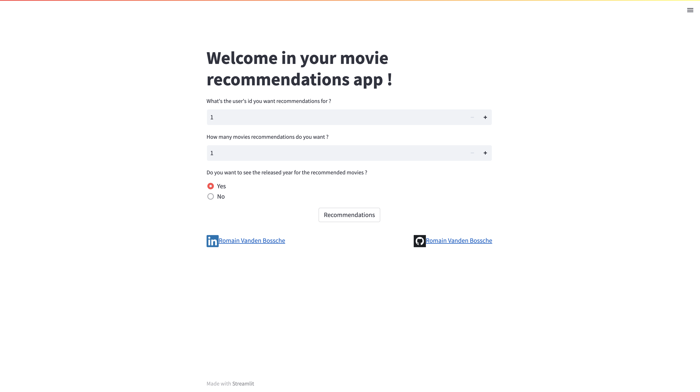
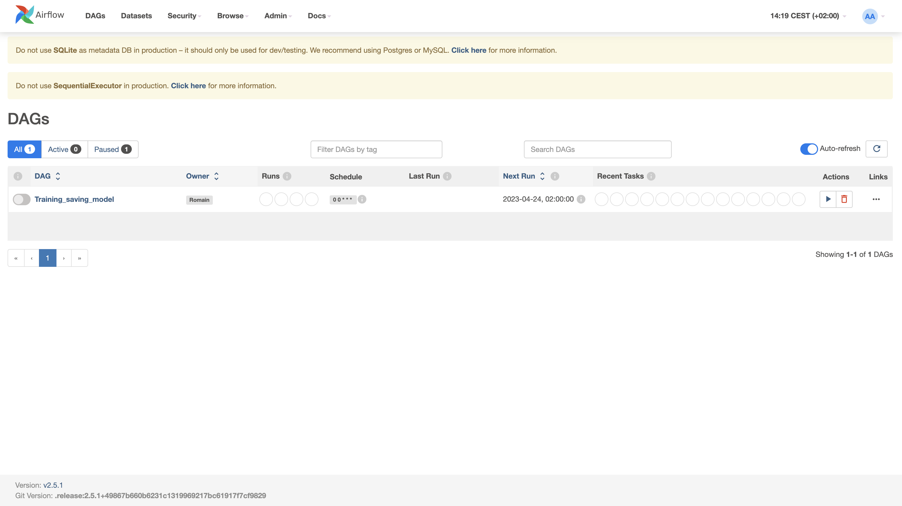

<div>
<h1 align="center"> Movie Recommendation System </h1>
</div>

## Description

In this project, I implemented a movie recommendation system script using PySpark, Streamlit, Apache Airflow, Docker and PostgreSQL together.

Duration : `7 days

## Tools

- PySpark : Python library for manipulating BigData faster and more powerfully than with Pandas.

- Streamlit : Python library for creating a nice app to deploy.

- Apache Airflow : Python library to schedule scripts.

- Docker : an application to run other applications in isolated small boxes named containers which are built from an image who is built from a Dockerfile or a docker-compose.yml file.

- PostgreSQL : an open-source and powerful database who is scalable for the most complex workloads, if needed.  

## Project Structure

- Dags folder : defines airflow's DAGs (Directed Acyclic Graph) in one file and my model_training function in another one. 
  
  An Airflow DAG is a collection of all the tasks you want to run, organized in a way that reflects their relationships and dependencies.
  
  

- Data folder : stores the csv files and the database script.

- Docker folder : contains 2 differents folders : One for airflow who contains the Docker_airflow file and ist requirements.txt file and the other one who contains the Docker_streamlit file and its requirements.txt file also. All these files create the environnement where everything will work toegheter.

- Model folder: contains a folder with the model from PySpark who makes the recommendations, saved. And a python script with a function to access the recommendations the model made for the data the user will give us.

Here is a picture to show you the project's structure


As you can see in the airflow-container, airflow is managing everything.

To clarify the relation between the three containers, the posgresql-container stores only the database. My python script (who is located in the airflow-container) contains the function who reruns the model when it's updated. PySpark manages the datas, trains and tests the model.

The streamlit-container displays the app has who could see it at the end. PySpark is needed to open the datasets, the model who was saved in the first container and to count the number of users in the datasets.

The postgresql-container contains the database with the tables where the csv files will be stored in the next version. Right now, the database exists and I manage to connect to it and to write the tables in it from the streamlit-container.

## Installation and Usage

1. To launch this project, you'll need to install and run Docker Desktop on your computer. You can find all you need to install it here : [Download Docker Desktop | Docker](https://www.docker.com/products/docker-desktop/)

2. Clone this repo

3. Open the root of the folder in your terminal

4. Build the docker image for airflow using Docker_airflow file to be able to use Airflow with any operating system

```docker
docker build -f docker/airflow/Docker_airflow -t airflow_image .
```

5. Build the docker image for streamlit using Docker_streamlit file to be able to use streamlit with any operating system

```docker
docker build -f docker/streamlit/Docker_streamlit -t streamlit_image .
```

6. Create a connection between containers using docker network

```docker
docker network create rec_movie_sys 
```

7. Create the docker container with Airflow from the airflow_image we've just built

```docker
docker run -itd --rm --network rec_movie_sys --name airflow-container -p 8080:8080 -v $(pwd):/docker_env airflow_image
```

7. Create the docker container with Streamlit from the streamlit_image we've just built

```docker
docker run -itd --rm --network rec_movie_sys --name streamlit-container -p 8501:8501 -v $(pwd):/docker_env streamlit_image
```

8. Create the docker container with PostgreSQL in it. This command will automatically pull the docker's image needed to run the container from dockerhub:

```docker
 docker run --rm --network rec_movie_sys --name postgres_container -e POSTGRES_PASSWORD=password -d -p 5432:5432 postgres
```

9. As the three dockers'containers are on the same network, you can click on this link to see the streamlit app live : [http://0.0.0.0:8501/](http://0.0.0.0:8501/).
   Now, you can play a bit around with the app, enjoy !
   
   

10. `If you want to go to the Airflow's portal you can click on this link : http://0.0.0.0:8080/

Username : admin

Password : admin


You click on the button on the left to activate the DAG. A few seconds later, you'll see a new folder named "ALS_Movie_Rec_model" in the model folder that contains the new files for the model who has just been saved. If you already have a folder called "ALS_Movie_Rec_model", delete it and you'll see it'll appear after running the dag.





## Results

My solution gives Movies Recommendations for :

- a defined user ID

- a defined number of movies recommendations desired

- with the release year of the recommended movies if desired

The main goal for this project was to make an app with streamlit to use the Movie Recommendation System built with PySpark. Afterwards, I put each part of the project in Docker containers to make it deployable on the cloud. And I begin to build the postgreSQL database to add new users with movie tastes and ratings in order to update the recommendations system with Airflow when we add new users. So, this structure can be "easily" adapted to add users to the database, updated regularly the model and retrain it when we add users, used on any operating system, and deployed online if needed.

## Examples

Here, you have an example of 3 recommendations movies for the user with the ID : 457 and the released year of the movies to be displayed.


Here, you have 2 movies recommendations for the user ID : 578 with the released year not displayed as required by the user.


## Improvements

- ###### Database
  
  - Add the csv files in it
  
  - Build a function to add new users with their movies tastes and ratings

- ###### Airflow :
  
  - With the improvements on the database, we could then update the model's recommendations when we add a new user to the database.

- ###### Docker
  
  - Create a docker-compose file to skip step 4 to step 8 included in the installation and usage procedure above.
  - I built one but I didn't know why yet when I launch it there is an issue with the database initialisation of Airflow whereas in my docker file, I don't have this problem and the docker compose uses this same docker file.

- ###### Deployment
  
  - Deploy it on the cloud 

## Contact

<div>
<a href="https://github.com/vdbromain">
  
</a>
<a href="https://www.linkedin.com/in/vdbromain/">
  
</a>
</div>
